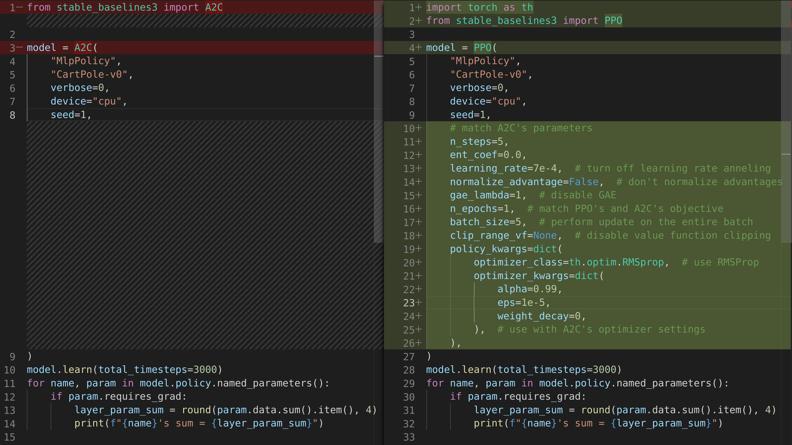
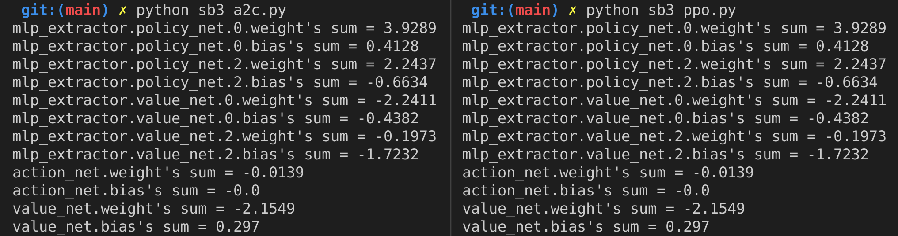

# A2C is a special case of PPO

We can match PPO and A2C's performance exactly by doing the following tweaks in PPO:

1. Match the learning rate parameter to be exactly $0.0007$ (also means turning off learning rate annealing), the entropy coefficient to $0$, and the number of steps to be $5$.
1. Turn off advantage normalization (enabled by [our SB3 fork](https://github.com/DLR-RM/stable-baselines3/pull/763))
1. Disable GAE by its `lambda` parameter to 1.
1. Set the number of update epochs $K$ to 1, so the clipped objective has nothing to clip.
1. Perform update on the whole batch of training data
1. Disable value function clipping.
1. Use A2C's RMSprop optimizer and configurations



To see it in action, run

```python
poetry install
poetry run python sb3_ppo.py
poetry run python sb3_a2c.py
```

we get the following screenshot, which shows the sum of the updated models' first layer's weights and they are exactly the same



Therefore, A2C is a special case of PPO when PPO 1) uses learning rate $=0.0007$ and turn off learning rate annealing,  2) set entropy coefficient $=0$, 3) set number of steps $=5$, 4) turn off advantage normalization, 5) disable GAE, 6) set update epoch $K=1$, 7) use whole batch of data for update, 8) disable value function clipping, and 9) use the RMSprop optimizer.


Short paper incoming...
